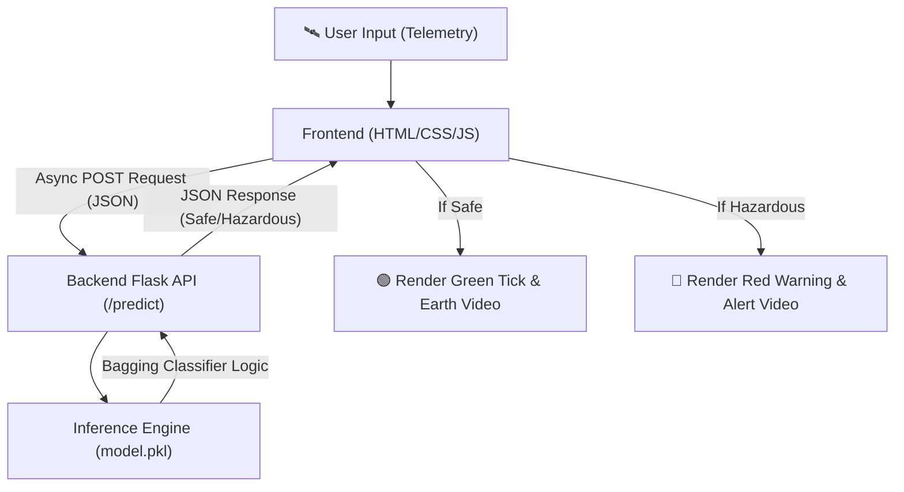

<div align="center">

  <h1>🛰️ O.R.I.O.N.</h1>
  <h3><i>Orbital Reconnaissance & Impact Observation Network</i></h3>

  <p>
    An end-to-end <b>Enterprise-Grade AI Planetary Defense System</b> powered by Bagging Ensemble Learning and Flask to classify hazardous near-Earth asteroids in real-time.
  </p>

  <p>
    <a href="https://python.org"></a>
    <a href="https://scikit-learn.org"></a>
    <a href="https://flask.palletsprojects.com/"></a>
    <a href="https://developer.mozilla.org/en-US/docs/Web/JavaScript"></a>
    <a href="https://replit.com/"></a>
  </p>

  <p>
    <a href="#key-features">Key Features</a> •
    <a href="#system-architecture">Architecture</a> •
    <a href="#dashboard-preview">UI Showcase</a> •
    <a href="#model-performance">Metrics</a> •
    <a href="#how-to-run">How to Run</a>
  </p>

  ---

</div>

## 📑 Table of Contents
- [📌 About The Project](#about-the-project)
- [📊 Dataset & Data Collection](#dataset-data-collection)
- [✨ Key Features & Capabilities](#key-features)
- [🎨 Dashboard Preview](#dashboard-preview)
- [🏗️ System Architecture](#system-architecture)
- [📊 Model Performance & Benchmark](#model-performance)
- [🚀 How to Run (Deployment)](#how-to-run)
- [📂 Repository Structure](#repository-structure)
- [🤝 Future Roadmap](#future-roadmap)
- [📬 Let's Connect!](#lets-connect)

---

<a id="about-the-project"></a>
## 📌 About The Project

Predicting whether a Near-Earth Object (NEO) poses a collision threat is a critical challenge. **O.R.I.O.N.** solves this by analyzing live astronomical telemetry using an advanced **Bagging Ensemble Classifier**. 

Unlike standalone Decision Trees that suffer from severe overfitting on imbalanced space data, O.R.I.O.N. effectively cancels out data noise and ensures maximum stability by taking the majority vote of independent base estimators. The system operates on a fully decoupled architecture, instantly serving threat probabilities to a state-driven Glassmorphism UI without page reloads.

---

<a id="dataset-data-collection"></a>
## 📊 Dataset & Data Collection

O.R.I.O.N. was trained using official telemetry from the **NASA Near Earth Object Web Service (NeoWs)**[cite: 1]. To ensure high accuracy and generalization, the data extraction and preprocessing pipeline handles severe class imbalances (hazardous asteroids are extremely rare)[cite: 1].

### 1. 🛰️ Astronomical Telemetry Dataset
- **Features Extracted:** Absolute Magnitude (H), Estimated Minimum/Maximum Diameter (km), Relative Velocity (km/s), and Miss Distance (km)[cite: 1].
- **Imbalance Handling:** Evaluated strictly on F1-Score, Precision, and ROC-AUC metrics instead of raw baseline accuracy to properly penalize false negatives (missing a real hazard)[cite: 1].

### 🗂️ Data Preprocessing & Optimization Pipeline

| Optimization Type | Technique Used | Purpose |
| :--- | :--- | :--- |
| **Data Extraction** | Direct NASA API Parsing | Ensures official, real-world data sourcing instead of static CSVs[cite: 1]. |
| **Memory Optimization** | Downcasting to `float32` / `int8` | Drastically reduces RAM consumption for cloud environments like Colab/Replit[cite: 1]. |
| **Model Tuning** | `GridSearchCV` & Stratified Splits | Fine-tunes `n_estimators`, `max_samples`, and `max_features` while preserving the highly imbalanced target ratio[cite: 1]. |

---

<a id="key-features"></a>
## ✨ Key Features & Capabilities

| Feature | Description | Technology |
| :--- | :--- | :--- |
| 🧠 **Variance Reduction** | Implements Bootstrap Aggregating to prevent overfitting on noisy, high-variance tabular data. | Scikit-Learn `BaggingClassifier`[cite: 1] |
| ⚡ **Decoupled API** | Lightweight backend endpoint (`/predict`) serving model probabilities as instantaneous JSON payloads. | Flask REST API[cite: 1] |
| 🚨 **Dynamic State Management** | Asynchronous updates trigger full-screen background video swaps based on Safe/Hazardous outputs. | Async JavaScript & DOM Manipulation[cite: 1] |
| 💎 **Command Center UI** | Translucent frosted-glass dashboard featuring high-contrast alerts and zero page reloads. | HTML5 & Custom CSS Glassmorphism[cite: 1] |
| ☁️ **Cloud-Native Deployment** | Runs entirely in the browser via Replit without requiring local installations. | Replit Ecosystem[cite: 1] |

---

<a id="dashboard-preview"></a>
## 🎨 Dashboard Preview

<div align="center">

| 🟢 Normal Trajectory State | 🚨 Critical Hazard State |
| :---: | :---: |
| *(Calm Earth Background Video)* | *(Dynamic Red Alert Background)* |
| **`[ ✅ SYSTEM STATUS: SAFE ]`** | **`[ ⚠️ POTENTIALLY HAZARDOUS ]`** |

> *Dashboard powered by custom CSS Glassmorphism and seamless JavaScript video swapping.*[cite: 1]

</div>

---

<a id="system-architecture"></a>
## 🏗️ System Architecture

O.R.I.O.N. follows an Enterprise-Grade decoupled architecture, separating the ML backend from the visual frontend[cite: 1]:



---

<a id="model-performance"></a>
## 📊 Model Performance & Benchmark

We evaluated **O.R.I.O.N.** by benchmarking a standard baseline model against our tuned ensemble architecture to prove variance reduction on highly imbalanced space data[cite: 1]:

| Model Version | Architecture | Cross-Val F1 Std (Variance) | Test F1-Score | Overfitting Status |
| :--- | :--- | :---: | :---: | :---: |
| **`Baseline`** | Single Decision Tree | **High** | Lower | Memorizes Noise[cite: 1] |
| **`model.pkl`** | Tuned Bagging Ensemble | **Drastically Reduced** | **Optimized** | Highly Stable[cite: 1] |

---

<a id="how-to-run"></a>
## 🚀 How to Run (Inference & UI)

**1. Clone the repository:**
```bash
git clone [https://github.com/your-username/ORION-AI-Defense.git](https://github.com/your-username/ORION-AI-Defense.git)
cd ORION-AI-Defense
```

**2. Ensure you have the trained model & assets:**
Make sure `model.pkl` is in the root directory and your background videos are located in `static/`[cite: 1].

**3. Install dependencies:**
```bash
pip install -r requirements.txt
```

**4. Run the Flask server:**
```bash
python app.py
```
*Navigate to `http://127.0.0.1:5000` in your browser to access the dynamic command center.*

---

<a id="repository-structure"></a>
## 📂 Repository Structure

```text
ORION_AI_Defense/
│
├── 🧠 model.pkl                   # Main Tuned Bagging Ensemble Weights[cite: 1]
├── ⚙️ app.py                      # Flask REST API Backend & Routing[cite: 1]
├── 📁 static/                     # Frontend Assets
│   ├── 🎨 style.css               # Glassmorphism Styling
│   ├── ⚡ script.js               # Async Logic & Dynamic Video Swapping[cite: 1]
│   └── 🎥 manan_video_1.mp4       # Alert/Hazard Background Video[cite: 1]
├── 📁 templates/
│   └── 🖼️ index.html              # Command Center UI Layout[cite: 1]
├── 📓 notebooks/
│   └── NASA_EDA_and_Training.ipynb # Complete ML Pipeline & Tuning[cite: 1]
├── 📋 requirements.txt            # Python Dependencies
└── 📜 README.md                   # Project Documentation
```

---

<a id="future-roadmap"></a>
## 🤝 Future Roadmap

- [x] Train baseline models and implement Variance Reduction via Bagging[cite: 1].
- [x] Build decoupled Flask API and state-driven Glassmorphism UI[cite: 1].
- [ ] Connect directly to the live NASA NeoWs API for automated daily scanning.
- [ ] Integrate SHAP (SHapley Additive exPlanations) for real-time feature contribution analysis on the frontend.

---

<a id="lets-connect"></a>
## 📬 Let's Connect!

I am currently studying machine learning, building projects in public, and actively seeking **AI / ML Engineering Internships and Full-Time Roles**.

- **LinkedIn:** [Manan Malvi](https://www.linkedin.com/in/manan-malvi-7849b5382/)
- **GitHub:** [GitHub Profile](https://github.com/)

<div align="center">
  <sub>Built with ❤️ for Planetary Defense & Machine Learning Innovation.</sub>
</div>
